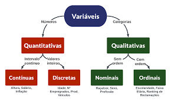
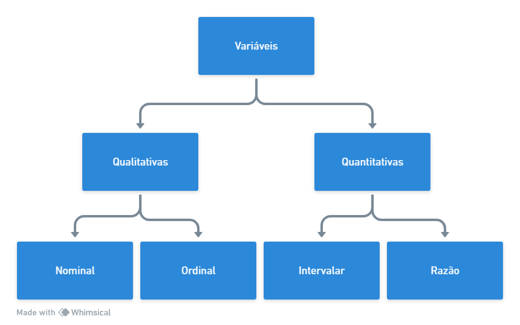

# Estatistica-Basica

## Capitulo 2

### Resumo de Dados:

Tabela 2.1 com informaçÕes de 36 empregados da seção de orçamentos da Companhia MB

<table border="1" class="dataframe">
  <thead>
    <tr style="text-align: right;">
      <th></th>
      <th>N</th>
      <th>Estado Civil</th>
      <th>Grau de Instrução</th>
      <th>N de Filhos</th>
      <th>Salario (x Sal Min)</th>
      <th>Anos</th>
      <th>Meses</th>
      <th>Região de Procedência</th>
    </tr>
  </thead>
  <tbody>
    <tr>
      <th>0</th>
      <td>1</td>
      <td>solteiro</td>
      <td>ensino fundamental</td>
      <td>NaN</td>
      <td>4.00</td>
      <td>26</td>
      <td>3</td>
      <td>interior</td>
    </tr>
    <tr>
      <th>1</th>
      <td>2</td>
      <td>casado</td>
      <td>ensino fundamental</td>
      <td>1.0</td>
      <td>4.56</td>
      <td>32</td>
      <td>10</td>
      <td>capital</td>
    </tr>
    <tr>
      <th>2</th>
      <td>3</td>
      <td>casado</td>
      <td>ensino fundamental</td>
      <td>2.0</td>
      <td>5.25</td>
      <td>36</td>
      <td>5</td>
      <td>capital</td>
    </tr>
    <tr>
      <th>3</th>
      <td>4</td>
      <td>solteiro</td>
      <td>ensino médio</td>
      <td>NaN</td>
      <td>5.73</td>
      <td>20</td>
      <td>10</td>
      <td>outra</td>
    </tr>
    <tr>
      <th>4</th>
      <td>5</td>
      <td>solteiro</td>
      <td>ensino fundamental</td>
      <td>NaN</td>
      <td>6.26</td>
      <td>40</td>
      <td>7</td>
      <td>outra</td>
    </tr>
    <tr>
      <th>5</th>
      <td>6</td>
      <td>casado</td>
      <td>ensino fundamental</td>
      <td>0.0</td>
      <td>6.66</td>
      <td>28</td>
      <td>0</td>
      <td>interior</td>
    </tr>
    <tr>
      <th>6</th>
      <td>7</td>
      <td>solteiro</td>
      <td>ensino fundamental</td>
      <td>NaN</td>
      <td>6.86</td>
      <td>41</td>
      <td>0</td>
      <td>interior</td>
    </tr>
    <tr>
      <th>7</th>
      <td>8</td>
      <td>solteiro</td>
      <td>ensino fundamental</td>
      <td>NaN</td>
      <td>7.39</td>
      <td>43</td>
      <td>4</td>
      <td>capital</td>
    </tr>
    <tr>
      <th>8</th>
      <td>9</td>
      <td>casado</td>
      <td>ensino médio</td>
      <td>1.0</td>
      <td>7.59</td>
      <td>34</td>
      <td>10</td>
      <td>capital</td>
    </tr>
    <tr>
      <th>9</th>
      <td>10</td>
      <td>solteiro</td>
      <td>ensino médio</td>
      <td>NaN</td>
      <td>7.44</td>
      <td>23</td>
      <td>6</td>
      <td>outra</td>
    </tr>
    <tr>
      <th>10</th>
      <td>11</td>
      <td>casado</td>
      <td>ensino médio</td>
      <td>2.0</td>
      <td>8.12</td>
      <td>33</td>
      <td>6</td>
      <td>interior</td>
    </tr>
    <tr>
      <th>11</th>
      <td>12</td>
      <td>solteiro</td>
      <td>ensino fundamental</td>
      <td>NaN</td>
      <td>8.46</td>
      <td>27</td>
      <td>11</td>
      <td>capital</td>
    </tr>
    <tr>
      <th>12</th>
      <td>13</td>
      <td>solteiro</td>
      <td>ensino médio</td>
      <td>NaN</td>
      <td>8.74</td>
      <td>37</td>
      <td>5</td>
      <td>outra</td>
    </tr>
    <tr>
      <th>13</th>
      <td>14</td>
      <td>casado</td>
      <td>ensino fundamental</td>
      <td>3.0</td>
      <td>8.95</td>
      <td>44</td>
      <td>2</td>
      <td>outra</td>
    </tr> 
    <tr>
      <th>14</th>
      <td>15</td>
      <td>casado</td>
      <td>ensino médio</td>
      <td>0.0</td>
      <td>9.13</td>
      <td>30</td>
      <td>5</td>
      <td>interior</td>
    </tr>
    <tr>
      <th>15</th>
      <td>16</td>
      <td>solteiro</td>
      <td>ensino médio</td>
      <td>NaN</td>
      <td>9.35</td>
      <td>38</td>
      <td>8</td>
      <td>outra</td>
    </tr>
    <tr>
      <th>16</th>
      <td>17</td>
      <td>casado</td>
      <td>ensino médio</td>
      <td>1.0</td>
      <td>9.77</td>
      <td>31</td>
      <td>7</td>
      <td>capital</td>
    </tr>
    <tr>
      <th>17</th>
      <td>18</td>
      <td>casado</td>
      <td>ensino fundamental</td>
      <td>2.0</td>
      <td>9.80</td>
      <td>39</td>
      <td>7</td>
      <td>outra</td>
    </tr>
    <tr>
      <th>18</th>
      <td>19</td>
      <td>solteiro</td>
      <td>superior</td>
      <td>NaN</td>
      <td>10.53</td>
      <td>25</td>
      <td>8</td>
      <td>interior</td>
    </tr>
    <tr>
      <th>19</th>
      <td>20</td>
      <td>solteiro</td>
      <td>ensino médio</td>
      <td>NaN</td>
      <td>10.76</td>
      <td>37</td>
      <td>4</td>
      <td>interior</td>
    </tr>
    <tr>
      <th>20</th>
      <td>21</td>
      <td>casado</td>
      <td>ensino médio</td>
      <td>1.0</td>
      <td>11.06</td>
      <td>30</td>
      <td>9</td>
      <td>outra</td>
    </tr>
    <tr>
      <th>21</th>
      <td>22</td>
      <td>solteiro</td>
      <td>ensino médio</td>
      <td>NaN</td>
      <td>11.59</td>
      <td>34</td>
      <td>2</td>
      <td>capital</td>
    </tr>
    <tr>
      <th>22</th>
      <td>23</td>
      <td>solteiro</td>
      <td>ensino fundamental</td>
      <td>NaN</td>
      <td>12.00</td>
      <td>41</td>
      <td>0</td>
      <td>outra</td>
    </tr>
    <tr>
      <th>23</th>
      <td>24</td>
      <td>casado</td>
      <td>superior</td>
      <td>0.0</td>
      <td>12.79</td>
      <td>26</td>
      <td>1</td>
      <td>outra</td>
    </tr>
    <tr>
      <th>24</th>
      <td>25</td>
      <td>casado</td>
      <td>ensino médio</td>
      <td>2.0</td>
      <td>13.23</td>
      <td>32</td>
      <td>5</td>
      <td>interior</td>
    </tr>
    <tr>
      <th>25</th>
      <td>26</td>
      <td>casado</td>
      <td>ensino médio</td>
      <td>2.0</td>
      <td>13.60</td>
      <td>35</td>
      <td>0</td>
      <td>outra</td>
    </tr>
    <tr>
      <th>26</th>
      <td>27</td>
      <td>solteiro</td>
      <td>ensino fundamental</td>
      <td>NaN</td>
      <td>13.85</td>
      <td>46</td>
      <td>7</td>
      <td>outra</td>
    </tr>
    <tr>
      <th>27</th>
      <td>28</td>
      <td>casado</td>
      <td>ensino médio</td>
      <td>0.0</td>
      <td>14.69</td>
      <td>29</td>
      <td>8</td>
      <td>interior</td>
    </tr>
    <tr>
      <th>28</th>
      <td>29</td>
      <td>casado</td>
      <td>ensino médio</td>
      <td>5.0</td>
      <td>14.71</td>
      <td>40</td>
      <td>6</td>
      <td>interior</td>
    </tr>
    <tr>
      <th>29</th>
      <td>30</td>
      <td>casado</td>
      <td>ensino médio</td>
      <td>2.0</td>
      <td>15.99</td>
      <td>35</td>
      <td>10</td>
      <td>capital</td>
    </tr>
    <tr>
      <th>30</th>
      <td>31</td>
      <td>solteiro</td>
      <td>superior</td>
      <td>NaN</td>
      <td>16.22</td>
      <td>31</td>
      <td>5</td>
      <td>outra</td>
    </tr>
    <tr>
      <th>31</th>
      <td>32</td>
      <td>casado</td>
      <td>ensino médio</td>
      <td>1.0</td>
      <td>16.61</td>
      <td>36</td>
      <td>4</td>
      <td>interior</td>
    </tr>
    <tr>
      <th>32</th>
      <td>33</td>
      <td>casado</td>
      <td>superior</td>
      <td>3.0</td>
      <td>17.26</td>
      <td>43</td>
      <td>7</td>
      <td>capital</td>
    </tr>
    <tr>
      <th>33</th>
      <td>34</td>
      <td>solteiro</td>
      <td>superior</td>
      <td>NaN</td>
      <td>18.75</td>
      <td>33</td>
      <td>7</td>
      <td>capital</td>
    </tr>
    <tr>
      <th>34</th>
      <td>35</td>
      <td>casado</td>
      <td>ensino médio</td>
      <td>2.0</td>
      <td>19.40</td>
      <td>48</td>
      <td>11</td>
      <td>capital</td>
    </tr>
    <tr>
      <th>35</th>
      <td>36</td>
      <td>casado</td>
      <td>superior</td>
      <td>3.0</td>
      <td>23.30</td>
      <td>42</td>
      <td>2</td>
      <td>interior</td>
    </tr>
  </tbody>
</table>

#### 2.1 Tipos de variáveis

Variaveis qualitativas nominais: Estadfo Civil, Região de Procedência
 Variaveis qualitativas ordinais: Grau de Instrução
 Variaveis quantitativas discretas: Número de Filhos, anos, meses
 variaveis quantitativas contínuas: Salario

#### 2.2 Distribuições de Frequências

Aqui podemos descobrir a ocorrencia das possíveis realizações de uma variavel. Abaixo a frequencia da variavel Grau de Instrução:  
Tabela 2.2 Frequencias e porcentagens dos 36 empregados da seção de orçamentos da Companhia MB segundo o grau de instrução

<table border="1" class="dataframe">
  <thead>
    <tr style="text-align: right;">
      <th></th>
      <th>Frequência</th>
      <th>Proporção</th>
      <th>Porcentagem %</th>
    </tr>
    <tr>
      <th>Grau de Instrução</th>
      <th></th>
      <th></th>
      <th></th>
    </tr>
  </thead>
  <tbody>
    <tr>
      <th>ensino médio</th>
      <td>18.0</td>
      <td>0.500000</td>
      <td>50.000000</td>
    </tr>
    <tr>
      <th>ensino fundamental</th>
      <td>12.0</td>
      <td>0.333333</td>
      <td>33.333333</td>
    </tr>
    <tr>
      <th>superior</th>
      <td>6.0</td>
      <td>0.166667</td>
      <td>16.666667</td>
    </tr>
    <tr>
      <th>Total</th>
      <td>36.0</td>
      <td>1.000000</td>
      <td>100.000000</td>
    </tr>
  </tbody>
</table>

 Tabela 2.3 Frequancias e porcentagens dos 4000 empregados da Companhia MB, segundo grau de instrução. 

<table border="1" class="dataframe">
  <thead>
    <tr style="text-align: right;">
      <th></th>
      <th>Frequência</th>
      <th>Porcentagem</th>
    </tr>
    <tr>
      <th>Grau de Instrução</th>
      <th></th>
      <th></th>
    </tr>
  </thead>
  <tbody>
    <tr>
      <th>Fundamental</th>
      <td>1650.0</td>
      <td>32.5</td>
    </tr>
    <tr>
      <th>Médio</th>
      <td>1020.0</td>
      <td>51.0</td>
    </tr>
    <tr>
      <th>Superior</th>
      <td>1330.0</td>
      <td>16.5</td>
    </tr>
    <tr>
      <th>Total</th>
      <td>4000.0</td>
      <td>100.0</td>
    </tr>
  </tbody>
</table>

  Tabela 2.4 frequencia de faixas de salario

<table border="1" class="dataframe">
  <thead>
    <tr style="text-align: right;">
      <th></th>
      <th>Frequência</th>
      <th>Porcentagem %</th>
    </tr>
    <tr>
      <th>Faixa Salarial</th>
      <th></th>
      <th></th>
    </tr>
  </thead>
  <tbody>
    <tr>
      <th>[4, 8)</th>
      <td>10.0</td>
      <td>27.777778</td>
    </tr>
    <tr>
      <th>[8, 12)</th>
      <td>12.0</td>
      <td>33.333333</td>
    </tr>
    <tr>
      <th>[12, 16)</th>
      <td>8.0</td>
      <td>22.222222</td>
    </tr>
    <tr>
      <th>[16, 20)</th>
      <td>5.0</td>
      <td>13.888889</td>
    </tr>
    <tr>
      <th>[20, 24)</th>
      <td>1.0</td>
      <td>2.777778</td>
    </tr>
    <tr>
      <th>Total</th>
      <td>36.0</td>
      <td>100.000000</td>
    </tr>
  </tbody>
</table>

#### Problemas

1. Escalas de medidas: A seguir descrevemos outros possíveis critérios para classificar variáveis, em função da escala adotada. Observe a similaridade com a classificação apresentada anteriormente. Nossas observações são resultados de medidas feitas sobre os elementos de uma população. Existem quatro escalas de medidas que podem ser consideradas.

    

    **Escala Nominal**: Nesta escala somente podemos afirmar se uma medida é diferente ou não da outra, e ela é usada para categorizar indivíduos de uma população. Um exemplo é o sexo de um indivíduo. Para cada categoria associamos um numeral diferente (letra ou número). Por exemplo, no caso do sexo, podemos associar as letras M (masculino) e F (feminino) ou 1 (masculino) e 2 (feminino). Não podemos realizar operações aritméticas aqui e uma medida de posição apropriada é a moda. (As medidas citadas nesses problemas, como a média, mediana e moda, são definidas no próximo capítulo).

    **Escala Ordinal**: Aqui, podemos dizer que uma medida é diferente e maior do que outra. Temos a situação anterior, mas as categorias são ordenadas, e a ordem dos numerais associados ordena as categorias. Por exemplo, a classe socioeconômica de um indivíduo pode ser baixa (1 ou x), média (2 ou y) e alta (3 ou z). Transformações que preservam a ordem não alteram a estrutura de uma escala ordinal. No exemplo acima, podemos representar as categorias por 1, 10 e 100 ou A, L e Z. Medidas de posição apropriadas são a mediana e a moda.

    **Escala Intervalar**: Nesta escala, podemos afirmar que uma medida é igual ou diferente, maior e quanto maior do que outra. Podemos quantificar a diferença entre as categorias da escala ordinal. Necessitamos de uma origem arbitrária e de uma unidade de medida. Por exemplo, considere a temperatura de um indivíduo, na escala Fahrenheit. A origem é 0º F e a unidade é 1º F. Transformações que preservam a estrutura dessa escala são do tipo y = ax+b, a > 0. Por exemplo, a transformação y = 5/9 (x - 32) transforma graus Fahrenheit em centígrados. Para essa escala, podemos fazer operações aritméticas, assim média, mediana e moda são medidas de posição apropriadas.

    **Escala Razão**: Dadas duas medidas nessa escala, podemos dizer se são iguais, ou se uma é diferente, maior, quanto maior e quantas vezes a outra. A diferença com a escala intervalar é que agora existe um zero absoluto. A altura de um indivíduo é um exemplo de medida nessa escala. Se ela for medida em centímetros (cm), 0 cm é a origem e 1 cm é a unidade de medida. Um indivíduo com 190 cm é duas vezes mais alto do que um indivíduo com 95 cm, e esta relação continua a valer se usarmos 1 m como unidade. Ou seja, a estrutura da escala razão não é alterada por transformações da forma y = cx, c > 0. Por exemplo, y = x/100 transforma cm em m. As estatísticas apropriadas para a escala intervalar são também apropriadas para escala razão.

    **Para cada uma das variaveis abaixo, indique a escala usualmente adotada para resumir os dados em tabelas de frequencia:**

    a) Salários dos empregados de uma indústria: Escala Razão

2. Usando os dados da Tabela 2.1, construa a distribuição de frequências das variáveis:

    (a) Estado civil. 
    (b) Região de procedência. 
    (c) Número de filhos dos empregados casados. 
    (d) Idade.